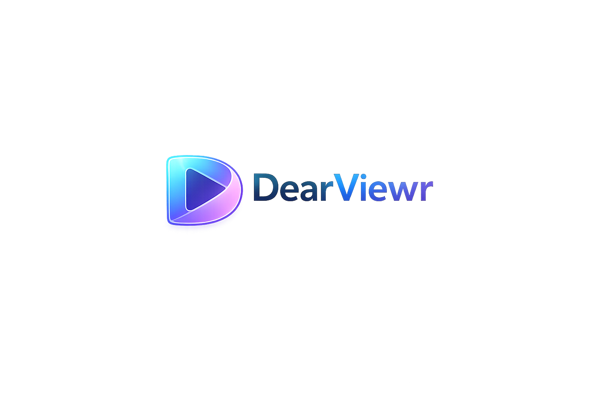

  

<h1 align="center">DearViewr</h1>

  <strong>Next-Generation Video Streaming Platform</strong> 
  Built for Creators. Designed for Viewers.

  
  
  

---

## 🚀 Overview

**DearViewr** is a modern, scalable, and performance-focused video streaming platform designed to deliver seamless content experiences.

It combines a clean user interface, secure authentication, admin control system, and HLS-based streaming support — all structured for future scalability.

---

## ✨ Core Features

- 🔐 Secure Authentication System
- 👨‍💼 Admin Dashboard
- 🎬 HLS Video Streaming
- 📺 Channel & Profile Pages
- 📂 Creator Panel
- 💾 Token-based Session Handling
- ⚡ Fast & Lightweight Frontend

---

## 🏗 Architecture

Frontend:
- HTML5
- CSS3
- JavaScript
- HLS.js

Backend:
- FastAPI
- JWT Authentication
- Nginx HLS Streaming

---

## 📁 Project Structure

---

## 🔮 Roadmap

- 📱 Mobile App Version
- 💰 Monetization System
- 🔒 Advanced Security Layer
- 📊 Creator Analytics Dashboard
- ☁ Cloud CDN Integration

---

## 👑 Founder

**Sushil**  
Visionary Behind DearViewr

---

## 📌 Status

Currently in active development phase.  
Major updates coming soon.

---

  Made with ❤️ for the future of streaming.

refresh auto merge workflow
refresh auto merge workflow
